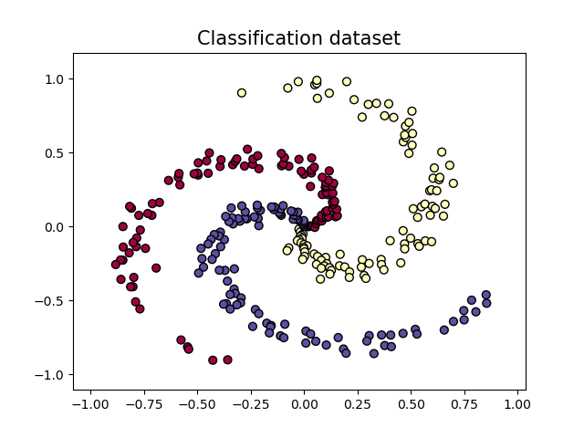
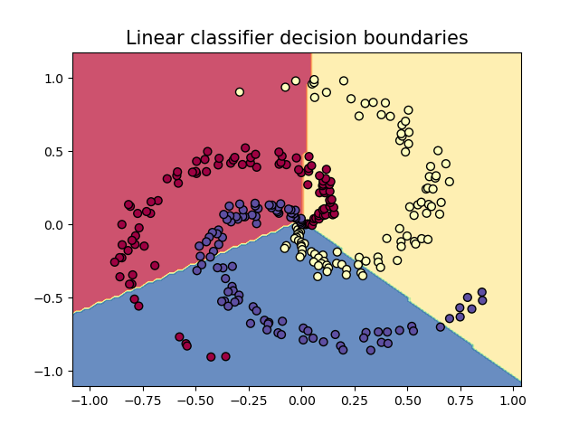
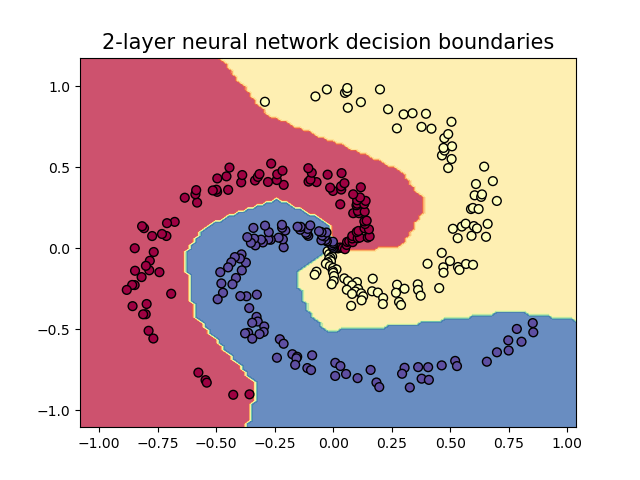
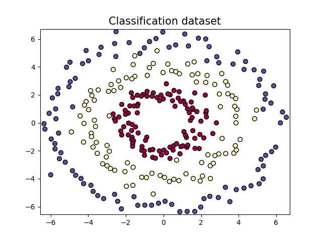
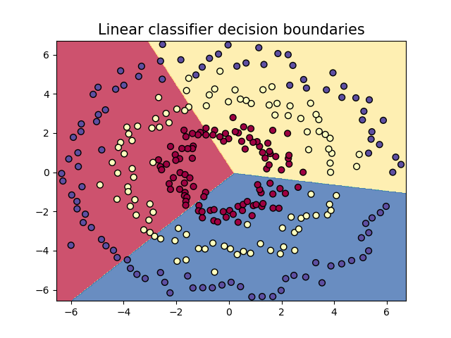
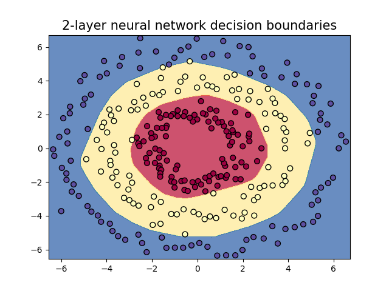

# 2-Layer Neural Network for Planar Data Classification

In this repository, we create a simple neural network that captures the shape of a distribution of yellow, blue and red dots. We first train a softmax linear classifier, then compare the results with a shallow neural network.

## Spiral dataset

As a first example, we check that the 2-layer neural network can learn the spiral shape of the dots:

 

## Circles dataset

As a second example, we check that the 2-layer neural network can learn the distribution of the dots in concentric circles:

 

